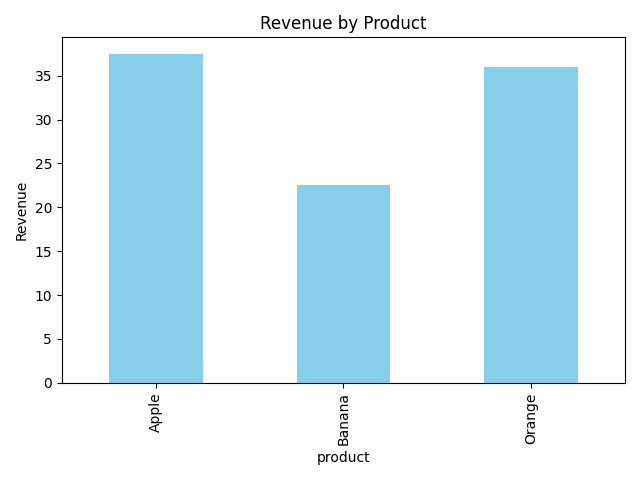

# Task 7 - Basic Sales Summary using SQLite & Python

## 📁 File Structure

```
Task7_Sales_Summary/
│── sales_data.db # SQLite database file
│── sales_summary.py # Python script for the task
│── sales_chart.png # Output bar chart image
│── README.md # Project documentation
│── sales_data_db.jpy # SQLite database schema img
```

## 🎯 Objective
Connect Python to an SQLite database, query sales data, and visualize the results.

## 📝 Steps Taken
1. Created `sales_data.db` with a `sales` table.
2. Inserted sample sales data.
3. Used SQL query with `GROUP BY` to calculate:
   - Total quantity sold per product.
   - Total revenue per product (`SUM(quantity * price)`).
4. Loaded data into Pandas and printed results.
5. Plotted a bar chart of revenue by product using Matplotlib.

## 🛠 Tools Used
- Python (`sqlite3`, `pandas`, `matplotlib`)
- SQLite (built into Python)
- Jupyter Notebook / Python script

## 📊 Output
- **Console Output**: Sales summary table.
- **sales_chart.png**: Bar chart of revenue by product.

## 📌 Sample Output
| product | total_qty | revenue |
|---------|-----------|---------|
| Apple   | 15        | 37.5    |
| Banana  | 15        | 22.5    |
| Orange  | 12        | 36.0    |


