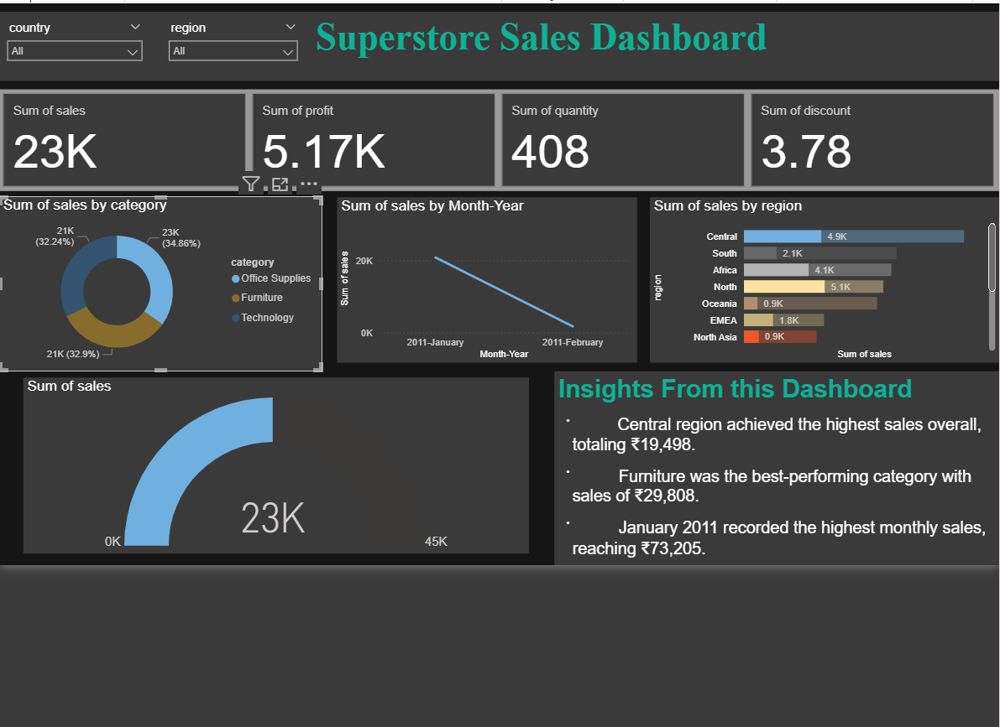
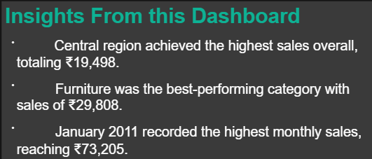

# 📊 Task 8: Simple Sales Dashboard Design


## 🎯 Objective
Create a basic interactive dashboard that shows sales performance by product, region, and month.

---
## 📁 File Structure

```
Task7_Sales_Summary/
│── Dashboard.png # Dashboard img 
│── Insights.png # Insights from the dashboard img 
│── SuperStore_Sales_Dashboard.pbix 
│── README.md # Project documentation
│── SuperStoreOrders.csv # Csv dataset
```
---

## 🛠 Tools Used
- **Power BI** (for dashboard creation)

---

## 📂 Dataset
**File:** `Superstore_Sales.csv`  
**Columns:** Order Date, Region, Category, Sales, Profit

---

## 🚀 Steps Followed
1. Imported the CSV file into **Power BI**.
2. Converted **Order Date** to "Month-Year" format.
3. Added visuals:
   - **Line Chart:** Sales over Months
   - **Bar Chart:** Sales by Region
   - **Donut Chart:** Sales by Category
   - **Gauge Chart:** Overall Sales Performance
   - **Cards:** Sum of Sales, Profit, Quantity, Discount
4. Added filters/slicers for **Country** and **Region**.
5. Wrote 3 short insights based on the dashboard.

---

## 📸 Dashboard Screenshot


---

## 💡 Insights from this Dashboard


**Key Findings:**
1. Central region achieved the highest sales overall, totaling ₹19,498.
2. Furniture was the best-performing category with sales of ₹29,808.
3. January 2011 recorded the highest monthly sales, reaching ₹73,205.

---

## 📈 Outcome
This task helped in understanding how to build a clean and interactive sales dashboard, and how to summarize data visually for business users.
